# FacePhys Demo

## Overview

FacePhys Demo is a browser-based remote photoplethysmography (rPPG) monitor. It uses State Space Models (SSMs) to extract heart rate and heart rate variability from facial video feeds via a standard webcam.

The application runs inference locally using LiteRT and WebAssembly. It is designed for edge environments, offering low latency (~5ms) with a model size of approximately 4MB.

## Privacy

* **Zero Data Upload:** All inference occurs on-device.
* **No Cloud Processing:** Video data and physiological signals are never transmitted to a server.
* **Offline Capable:** The application functions without an internet connection once loaded.

## Features

* **State Space Models:** Models heart dynamics as continuous-time controlled ODEs to handle irregular sampling.
* **Multi-threaded Architecture:** Uses Web Workers for inference, PSD calculation, and plotting to maintain UI responsiveness.
* **Visualization:** Displays real-time attention heatmaps, 3D state trajectories, and BVP/PSD waveforms.
* **Interface:** Windows 95/98 style UI.

## Installation (PWA)

This project is a Progressive Web App (PWA) and can be installed as a standalone application.

### Desktop (Chrome / Edge)
1.  Open the website.
2.  Click the Install icon in the address bar.

### Android
1.  Open the website in Chrome.
2.  Open the menu and select **Add to Home screen** or **Install App**.

### iOS
1.  Open the website in Safari.
2.  Tap the Share button and select **Add to Home Screen**.

## License & Privacy Protocol

This project is licensed under the **MIT License** with a **Privacy Addendum**.

### The MIT License (MIT)
Copyright (c) 2024 Kegang Wang

Permission is hereby granted, free of charge, to any person obtaining a copy of this software and associated documentation files (the "Software"), to deal in the Software without restriction, including without limitation the rights to use, copy, modify, merge, publish, distribute, sublicense, and/or sell copies of the Software, and to permit persons to whom the Software is furnished to do so, subject to the following conditions:

The above copyright notice and this permission notice shall be included in all copies or substantial portions of the Software.

### Privacy Protection Addendum
**By using or distributing this software, you agree to the following additional terms:**

1.  **Non-Transmission of Data:** Any deployment, modification, or derivative work of this Software must **NOT** transmit, upload, stream, or otherwise share user video feeds, facial data, or extracted physiological metrics to any external server, cloud service, or third-party endpoint.
2.  **Local Processing Requirement:** All biometric inference and signal processing must remain on the local device.
3.  **Privacy Preservation in Distribution:** If you redistribute this Software or a derivative work, you must ensure that these privacy guarantees remain intact. You may not modify the code to surreptitiously collect user data.

THE SOFTWARE IS PROVIDED "AS IS", WITHOUT WARRANTY OF ANY KIND, EXPRESS OR IMPLIED, INCLUDING BUT NOT LIMITED TO THE WARRANTIES OF MERCHANTABILITY, FITNESS FOR A PARTICULAR PURPOSE AND NONINFRINGEMENT. IN NO EVENT SHALL THE AUTHORS OR COPYRIGHT HOLDERS BE LIABLE FOR ANY CLAIM, DAMAGES OR OTHER LIABILITY, WHETHER IN AN ACTION OF CONTRACT, TORT OR OTHERWISE, ARISING FROM, OUT OF OR IN CONNECTION WITH THE SOFTWARE OR THE USE OR OTHER DEALINGS IN THE SOFTWARE.
